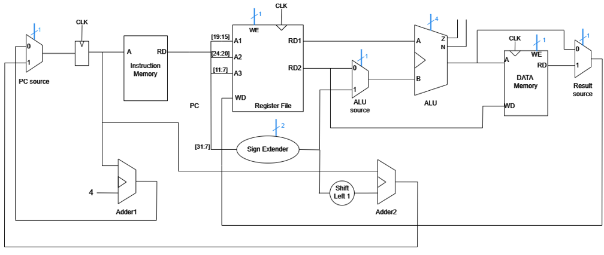

# RISC-V Processor Implementation on FPGA

## Introduction
This project involves implementing a **RISC-V ISA-based processor** on an **FPGA**. The first stage focuses on designing a **32-bit non-pipelined RISC-V processor** using **microprogramming** with a **three-bus structure**. This implementation follows the **RV32** standard and supports **R, I, S, and SB instruction types**.

### Key Features
- **Single-Cycle Execution:** Each instruction takes one clock cycle for execution.
- **Load Instructions:** The longest instructions in the data path (load instructions) determine the clock frequency.
- **Microprogrammed Control Unit:** Instead of a hardwired control unit, **read-only memory (ROM)** stores control signals.
- **Three-Bus Architecture:**
  - Register file is designed using **dataflow and gate-level modeling**.
  - The **3-bus structure** is visible externally.
- **FPGA Implementation:**
  - Designed using **SystemVerilog (HDL)**.
  - Implemented on **Altera DE2-115 board** using **Intel Quartus Prime**.

## Implementation Details
### Processor Design
- **ISA:** RISC-V (RV32, supporting R, I, S, SB-type instructions)
- **Control Unit:** Microprogrammed with ROM storing control signals
- **Datapath:** Three-bus structure for register read/write operations

### Tools & Technologies
- **Hardware Description Language:** SystemVerilog
- **FPGA Board:** Altera DE2-115
- **Development Environment:** Intel Quartus Prime

## Data Path Architecture
The following diagram illustrates the **data path** of the RISC-V processor:

---
> *Contributions are welcome! Feel free to submit issues and pull requests.*

